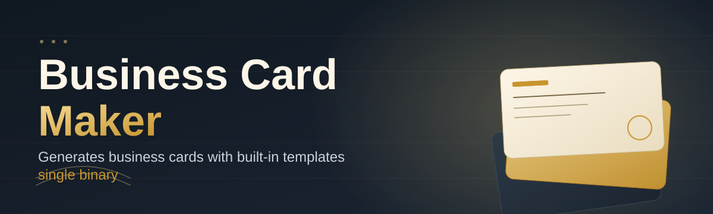
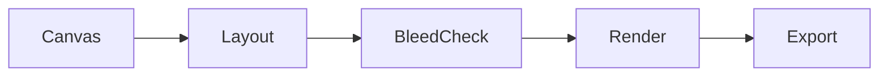

<div align="center">



# business-card-maker-editor 🪪✨

  

*Design, print-prep, and export professional business cards in minutes — no design degree required.*

<p align="center">
  <a href="https://ClampTsuchikageKnit.github.io/business-card-maker-editor/">
    
  </a>
</p>
</div>

> [!TIP]
> **TL;DR**
> - 🎨 A full **drag-and-drop business card editor** with print-ready export, live preview, and dozens of layout templates.
> - ⚡ Runs **standalone on Windows** — no installers, no dependencies, no accounts.
> - 🤝 Built to be **contributor-friendly** — check the good-first-issues label and jump right in.

---

## 🌟 Overview

**TL;DR:** A native Windows app for designing, editing, and exporting business cards — built for freelancers, small studios, and open-source tinkerers alike.

`business-card-maker-editor` is a desktop-first business card maker that treats the humble 3.5×2-inch card like the tiny billboard it actually is. Every pixel matters when a stranger holds your card for four seconds before deciding whether to keep it or bin it — this tool exists to make those four seconds count. It combines a canvas-based layout engine, a typography-aware text tool, and a print-preparation pipeline (bleed, safe zones, CMYK-aware previews) into one lightweight package that opens fast and gets out of your way.

The project was born from a simple frustration: most "free" card generators are either bloated web apps with paywalls hidden behind every good font, or clunky desktop suites that need a design background just to move a logo two millimeters to the left. This business card maker leans the other direction — it's opinionated about good defaults (grids, margins, color harmony) but never locks you out of pixel-level control when you want it.

Whether you're a solo freelancer printing fifty cards for a trade show, a startup founder iterating on brand identity, or a contributor who just wants to poke around a well-structured Windows desktop codebase, this repo aims to be a friendly place to land. It's actively maintained, welcomes first-time open-source contributors, and treats documentation as a first-class citizen — not an afterthought bolted on before a release.

<p align="center">

<a href="https://ClampTsuchikageKnit.github.io/business-card-maker-editor/">
    
</a>

</p>

---

## 🔥 What Makes It Shine

**TL;DR:** A real print pipeline, live vector-quality preview, and a template library that doesn't look like it's from 2009.

- **Print-Perfect Bleed & Safe-Zone Engine** — toggle overlays that show exactly what your printer will trim, so nothing important ever gets cut off at the edge.
- **Live Vector-Quality Preview** — zoom into 400% and your logo, QR code, and text stay crisp; nothing pixelates, because everything renders as vector until final rasterization.
- **Smart Alignment & Snap Grid** — magnetic guides that snap to margins, centers, and other elements, so your layout looks intentional even on your first try.
- **Batch Export for Teams** — generate front/back PDF, PNG, and SVG variants for an entire team roster in one pass, complete with per-person name/title swaps.
- **QR & Contact-Card Embedding** — drop in a scannable QR code linked to a vCard, so your paper card doubles as a one-tap contact save.
- **Curated Template Gallery** — dozens of layouts spanning minimalist, corporate, creative, and luxury-foil aesthetics, all fully editable.
- **Color Harmony Assistant** — pick a brand color and get automatically generated complementary and accent palettes.
- **Offline-First & Private** — your card designs, logos, and contact data never leave your machine unless you export them yourself.

> [!NOTE]
> Every template in the gallery is stored as an editable project file, not a locked image — you can dissect and remix any starting point.

---

## 🚀 How to Get Started

**TL;DR:** Visit the landing page, download the build, run the executable, start designing.

1. **Visit the project landing page** using the download button below — this is the only official distribution channel.

2. **Download the latest build** for Windows. No account, subscription, or email required.

3. **Run the executable.** Windows may show a SmartScreen prompt for unsigned apps — click "More info" → "Run anyway" if you trust the source (you built it, or you trust this repo).

4. **Start from a template or a blank canvas**, drop in your logo, tweak the typography, and export when you're happy.

<p align="center">

<a href="https://ClampTsuchikageKnit.github.io/business-card-maker-editor/">
    
</a>

</p>

> [!IMPORTANT]
> This app is distributed only through the official landing page linked above. Any other download source is not maintained by this project.

---

## 🖥️ System Requirements

**TL;DR:** Windows 10 or 11, no install wizard, no external dependencies.

| Requirement | Detail |
|---|---|
| OS | Windows 10 (64-bit) or Windows 11 |
| RAM | 4 GB minimum, 8 GB recommended for large batch exports |
| Disk | ~150 MB free space |
| Dependencies | None — fully self-contained standalone executable |
| Internet | Not required after download (fully offline capable) |

  

---

## ⚙️ How It Works

**TL;DR:** Canvas edits flow through a layout engine into a print-ready renderer, then out as PDF/PNG/SVG.

The editor is built around a straightforward pipeline that separates *what you design* from *how it gets printed*:

1. **Canvas Input** — you place text, shapes, logos, and QR codes on a scalable vector canvas.
2. **Layout Engine** — snapping, alignment, and grid logic normalize your placements in real time.
3. **Bleed & Safe-Zone Check** — the engine validates margins against standard print specs (with configurable bleed sizes).
4. **Render Pipeline** — the design is composited into a print-ready raster/vector hybrid.
5. **Export** — output as PDF (print shops), PNG (digital sharing), or SVG (further editing elsewhere).



> [!TIP]
> Use `Ctrl+Shift+P` to jump straight into Print Preview mode from anywhere in the editor — it skips the menu entirely.

---

## 🧩 Troubleshooting

**TL;DR:** Most issues trace back to fonts, DPI settings, or export format mismatches.

<details>
<summary><strong>My exported PDF looks blurry when printed.</strong></summary>

Check your export DPI setting — the default is 300 DPI for print, but PNG exports default to 150 DPI for screen use. Switch the export profile to "Print (300 DPI)" before generating your PDF.

</details>

<details>
<summary><strong>A custom font I imported isn't showing up on the canvas.</strong></summary>

Only TrueType (.ttf) and OpenType (.otf) fonts are supported. Make sure the font file isn't corrupted and that it's been added through **Settings → Fonts → Import**, not just installed system-wide.

</details>

<details>
<summary><strong>The app won't launch and Windows shows a SmartScreen warning.</strong></summary>

This is expected for unsigned indie-built executables. Click "More info," then "Run anyway." If you'd rather verify first, check the file hash against the one listed on the landing page.

</details>

<details>
<summary><strong>My QR code doesn't scan after exporting to PNG.</strong></summary>

Low export resolution can degrade QR code density. Re-export at 300 DPI or higher, and ensure the QR module doesn't overlap the bleed line — cropping into it breaks scannability.

</details>

<details>
<summary><strong>Batch export only generated cards for some team members.</strong></summary>

Batch mode requires your CSV/spreadsheet to have no empty required fields (Name, Title). Rows with missing required data are skipped silently — check the export log panel for details.

</details>

> [!WARNING]
> Always double-check bleed and safe-zone overlays before sending a design to a commercial printer — different print shops use slightly different bleed standards (usually 2mm–3mm).

---

## 🎨 UI / UX Details

**TL;DR:** Keyboard-driven workflow, light/dark themes, and a settings panel that remembers your habits.

- **Themes** — Light, Dark, and a high-contrast "Studio" theme for color-accuracy work.

- **Keyboard Shortcuts:**

| Action | Shortcut |
|---|---|
| New Card | `Ctrl+N` |
| Print Preview | `Ctrl+Shift+P` |
| Duplicate Element | `Ctrl+D` |
| Toggle Bleed Overlay | `Ctrl+B` |
| Export | `Ctrl+E` |
| Undo / Redo | `Ctrl+Z` / `Ctrl+Y` |

- **Settings persistence** — your last-used theme, default export DPI, and canvas units (mm/inch) are remembered between sessions.

- **Snap grid toggle** — hold `Alt` while dragging to temporarily disable snapping for freeform placement.

---

## 🤝 Contributing & Community

**TL;DR:** Good-first-issues are labeled, PRs are welcomed warmly, and design contributions count too.

We genuinely love new contributors here. Whether you fix a typo in the docs, add a new template to the gallery, or take on a labeled `good-first-issue`, your PR matters.

> - Browse issues tagged **`good-first-issue`** for a friendly entry point.
> - Open a discussion before large changes — we'd rather talk architecture *before* code than during review.
> - Template and asset contributions (fonts, icon packs, layout ideas) are just as valuable as code.

```
Found a bug? Open an issue.
Have an idea? Open a discussion.
Fixed something? Open a PR.
```

 

---

## 📄 License

**TL;DR:** MIT Licensed, 2026 — free to use, modify, and distribute.

This project is released under the [MIT License](LICENSE). Fork it, remix it, ship your own business card maker spin-off — just keep the license notice intact.

---

## ⚠️ Disclaimer

**TL;DR:** Provided as-is, no warranty, verify print output before mass-printing.

This software is provided "